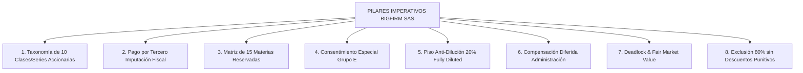

# ESTÁNDAR BINDING IMPERATIVO PISOSO LEGAL AI: TIER-1 BIGFIRM & VENTURE CAPITAL LAW

**CÓDIGO DE PROTOCOLO:** PROTOCOL-PISOSO-BIGFIRM-001  
**APLICABILIDAD:** DERECHO SOCIETARIO, CONSTITUCIÓN DE SAS, ARQUITECTURA CONTRACTUAL, PACTOS DE ACCIONISTAS (SHA) Y VENTURE CAPITAL  
**JURISDICCIÓN:** REPUBLICA DE COLOMBIA (LEY 1258 DE 2008 & CÓDIGO DE COMERCIO)  

---

## 1. PRINCIPIO DE NO SÍNTESIS Y PROHIBICIÓN ABSOLUTA DE COMPENDIOS

1. **Prohibición de Resúmenes y Esqueletos:** Queda estrictamente prohibido a cualquier agente del sistema Pisoso Legal AI (`00-Orquestador`, `07-Redactor-Junior`, `08-Redactor-Senior`, `09-Compilador`) generar estatutos, contratos o pactos de accionistas en versión resumida, compendiada, de síntesis o en formato de borrador de ejemplo.
2. **Prosa Legal Completa y Exhaustiva:** Todo documento normativo corporativo debe redactarse en prosa legal pura, completa e inatacable, desplegando la totalidad de capítulos, artículos, párrafos y sub-incisos (`Subcláusula Legal`), sin omitir definiciones, reglas supletorias, salvedades ni procedimientos de debido proceso.
3. **Extensión Estándar BigFirm para SAS:** La constitución de una S.A.S. de alta gama o con estructura de fundadores e inversionistas exige una estructura troncal de **11 Capítulos y 80+ Artículos**.

---

## 2. ARQUITECTURA SOCIETARIA OBLIGATORIA (S.A.S. TIER-1)

Todo borrador de estatutos o pacto de socios estructurado por Pisoso Legal AI debe incorporar imperativamente los siguientes 8 pilares técnicos de Derecho Corporativo y Venture Capital:

### A. Taxonomía de 10 Clases y Series Accionarias
No se permite limitar el capital a acciones ordinarias simples. Se debe normar la estructura multiclase:
1. **Serie OF-T (Acciones Ordinarias de Fundador Inversionista):** Suscritas por el socio capitalista.
2. **Serie OF-E (Acciones Ordinarias de Fundador Gestor):** Suscritas por el socio gestor, acompañadas de derechos especiales de gobernanza.
3. **Clase O (Acciones Ordinarias Generales):** Para transferencias a terceros o capitalizaciones ordinarias.
4. **Clase P (Acciones Privilegiadas):** Con prerrogativas económicas de reembolso o retorno.
5. **Clase DP (Acciones con Dividendo Preferencial y Sin Derecho a Voto):** Con dividendo mínimo regulado.
6. **Clase DF (Acciones con Dividendo Fijo Anual):** Acumulable o no acumulable.
7. **Clase AP (Acciones de Pago):** Para extinción de obligaciones con acreedores o contratistas.
8. **Clase VM (Acciones de Voto Múltiple):** Para estructuración de control.
9. **Clase PCI (Acciones Preferentes Convertibles de Inversión):** Diseñadas para fondos de Venture Capital / PE (incorporan *Liquidation Preference*, anti-dilución, conversión e información).
10. **Clase IR (Acciones de Incentivo y Retención):** Pool para opciones y planes ESOP de empleados/administradores (hasta 5% *Fully Diluted*).

### B. Mecanismo de Imputación de Pago por Tercero (Protección DIAN)
- Para evitar contingencias tributarias por aportes de industria o servicios inmateriales no pagados, la totalidad del capital inicial en dinero desembolsado por el inversionista se imputará mediante **Instrucción Irrevocable de los Fundadores**: una fracción paga sus acciones de fundador y el remanente se imputa al **pago por tercero de las acciones del fundador gestor**.
- La sociedad no registrará cuentas por cobrar ni presunción de ingreso gravable, reconociendo el valor de la estructuración jurídica y dirección previa sin convertir los servicios en condición de vesting o recompra.

### C. Matriz de Materias Reservadas (15 Decisiones Estratégicas)
Lista taxativa de 15 materias que requieren quórum cualificado especial y consentimiento de fundadores:
1. Reforma estatutaria y cambio de domicilio.
2. Fusión, escisión, transformación o reorganización.
3. Aumento de capital autorizado o emisión con renuncia al derecho de preferencia.
4. Emisión o asunción de instrumentos convertibles, SAFE, warrants u opciones.
5. Creación o colocación de acciones PCI, IR o VM.
6. Enajenación, gravamen o licencia exclusiva de propiedad intelectual material.
7. Enajenación de activos esenciales de más de 100 SMMLV.
8. Aprobación de presupuestos anuales y endeudamiento superior a límites fijados.
9. Aprobación de estados financieros y reparto de utilidades/dividendos.
10. Inicio de nuevas líneas de negocio o cambio de objeto.
11. Transacciones con partes vinculadas o administradores.
12. Readquisición de acciones propias.
13. Selección de la firma auditora o valoradora de Fair Market Value.
14. Presentación a reorganización o liquidación voluntaria.
15. Aprobación de eventos de Exit o IPO.

### D. Consentimiento Especial del Grupo Fundador E
- Mientras el Grupo Fundador E conserve en *Base Totalmente Diluida (Fully Diluted)* una participación igual o superior al **20.00%**, ninguna Materia Reservada que afecte de manera directa los derechos, participación, dilución o gestión del fundador gestor podrá aprobarse sin su **voto o consentimiento previo por escrito**.

### E. Regla de Dilución Equitativa y Piso Anti-Dilución al 20% (Fully Diluted)
- **Fase Inicial:** Dilución pro-rata entre Grupos Fundadores T y E.
- **Congelamiento Anti-Dilución al 20%:** Al alcanzar el Grupo E el 20% en *Base Totalmente Diluida*, las emisiones posteriores diluirán **exclusivamente al Grupo Fundador T** hasta que este alcance también el 20%.
- **Restablecimiento 20/20:** Al quedar ambos al 20% (y terceros con el 60%), se reanuda la dilución pro-rata.
- **Cuadro de Capitalización Obligatorio:** Toda operación dilutiva exige cuadro *Pre-Money* y *Post-Money* certificado antes del cierre.

### F. Compensación Diferida de Administración
- Reconocimiento de los honorarios no cobrados en efectivo por el Representante Legal durante el arranque como una **causación contable de pasivo corporativo**, para pago prioritario al certificar el Punto de Equilibrio (*Break Even*) o en la cascada de *Exit* / Liquidación.

### G. Escalamiento de Deadlock y Fair Market Value
- **Deadlock:** Definido estrictamente por parálisis de más de 45 días sobre Materias Reservadas indispensables.
- **Escalamiento en 3 Fases:** Negociación directa (10 días) -> Mediación Cámara de Comercio de Cartagena (30 días) -> Peritaje de *Fair Market Value* (Flujo de Caja Descontado / Múltiplos) por firma independiente.
- **Salida:** Oferta cruzada binding a valor de mercado no inferior al *Fair Market Value*.

### H. Exclusión y Debido Proceso (80% Voto Excluido Afectado)
- 7 causales graves (LA/FT/FPADM, fraude, competencia prohibida, desacato estatutario).
- Aprobación requerida del 80% de acciones sin computar al afectado.
- **Prohibición de Descuentos Punitivos:** Reembolso a valor en libros o pericial sin penalizaciones confiscatorias.

---

## 3. MAPEO ESTRICTO DE ESTILOS EN WORD (.DOCX)

Todo documento final debe ser compilado utilizando el mapeo exacto de estilos tipográficos de la plantilla Pisoso Legal:

- `# Título Principal` -> Estilo Word: **`Doc Título`**
- `**Metadatos / Subtítulo**` -> Estilo Word: **`Doc Subtítulo`**
- `## CAPÍTULO...` -> Estilo Word: **`H1`**
- `### ARTÍCULO...` -> Estilo Word: **`Artículo Legal`**
- `#### Sub-inciso (X.1...)` -> Estilo Word: **`Subcláusula Legal`**
- `> Nota Legal` -> Estilo Word: **`Nota Legal`**
- `Texto Normal` -> Estilo Word: **`Body Legal`**
- `1. Lista / - Viñeta` -> Estilos Word: **`List Number`** / **`List Bullet`**
